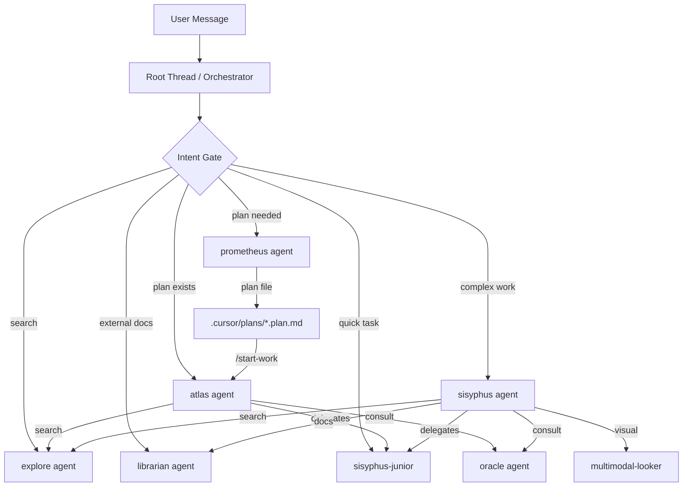
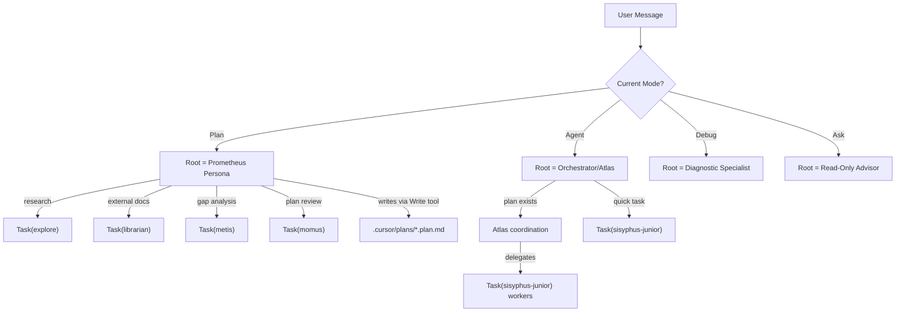
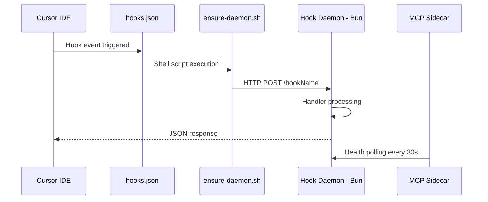
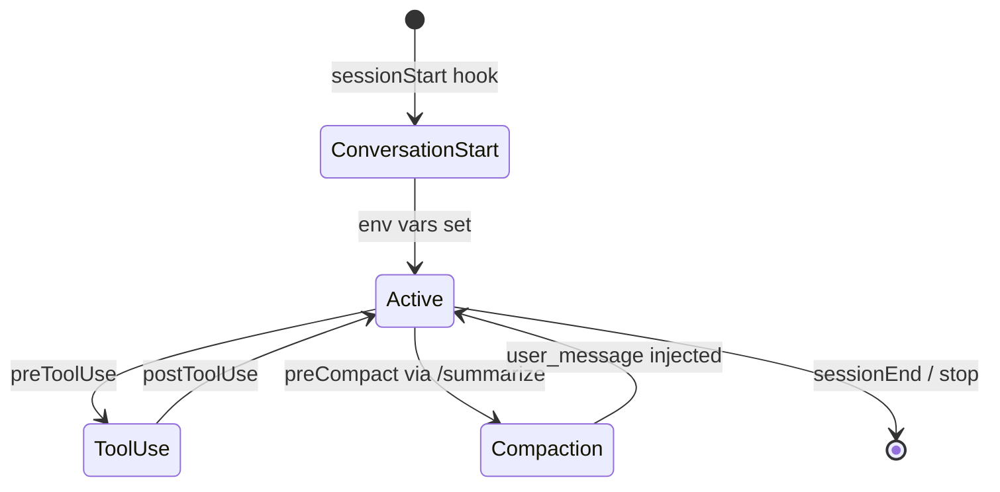
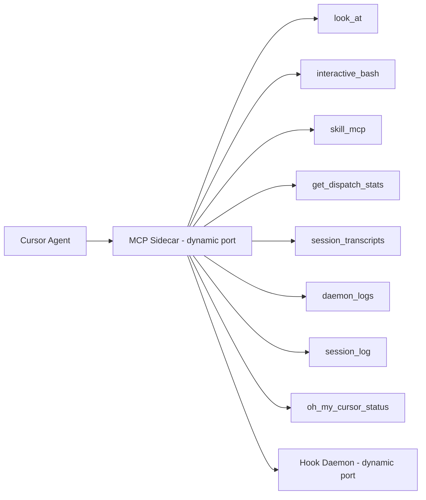
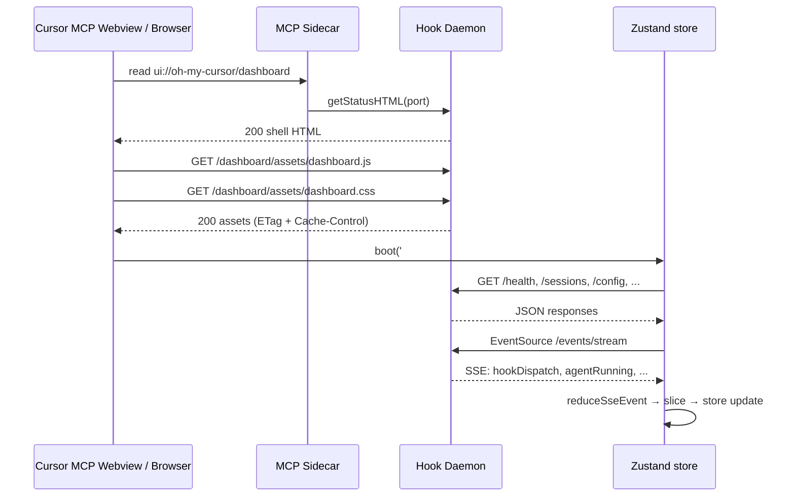

# oh-my-cursor Architecture

This document describes the system architecture of oh-my-cursor, a multi-agent orchestration plugin for Cursor IDE.

## Overview

oh-my-cursor provides 11 specialized agents, a persistent hook daemon, MCP sidecar, and continuation loops. The system intercepts Cursor's hook events via shell scripts that forward to a Bun-based HTTP daemon, which processes events and returns context injections.

## Agent Orchestration Flow

### Mode-Based Routing (Native Mode)

Cursor's native mode system drives top-level routing: (Mode is detected via `detectPlanMode()` heuristics — hook payloads do not include a mode field. See [sharp edges](docs/cursor/19-known-sharp-edges.md#composer-mode-not-in-hook-payloads).) **Plan mode** activates the Prometheus persona (research + plan writing), while **Agent mode** activates the Orchestrator/Atlas persona (dispatch, verify, coordinate). Debug and Ask modes are read-only.

## Hook Daemon Data Flow

## Conversation Lifecycle

## MCP Sidecar Architecture

## Dashboard UI

The dashboard is a SPA that lives in [`hooks/dashboard-ui/`](hooks/dashboard-ui/) and is built with Vite 8 + React 19 + Tailwind v4 + shadcn/ui + Zustand 5. The installer compiles it (`bun install --frozen-lockfile && bunx --bun vite build` inside `hooks/dashboard-ui/`); the build emits `dist/assets/dashboard.js`, `dist/assets/dashboard.css`, and chunked vendor bundles. The daemon resolves `dashboard-ui/dist/` relative to itself and serves both the shell HTML and the assets.

### Project layout

- `src/main.tsx` — entrypoint that mounts `<App />` into `#app`.
- `src/App.tsx` / `src/components/Shell.tsx` — top-level providers and the tab/shortcut shell.
- `src/components/ui/` — shadcn/ui primitives (button, card, sheet, …).
- `src/tabs/` — one file per dashboard tab; `tabs/registry.ts` is the single source of truth for tab order and hotkeys.
- `src/store/dashboard.ts` — Zustand store (UI slice + connection slice + data slice) with selective persistence.
- `src/store/selectors.ts` — memoised selectors used by tabs.
- `src/lib/api.ts` — typed REST client; the daemon contract is documented in `src/lib/api.endpoints.md`.
- `src/lib/sse.ts` — EventSource adapter with exponential backoff + jitter reconnects.
- `src/lib/sse-reducer.ts` — pure SSE reducer (the W1.6 port of the legacy `sse-payload-from-event` + `merge-by-agent-id` helpers).

### Daemon static-asset routes

| Route | Status | Body | Notes |
|-------|--------|------|-------|
| `GET /dashboard` | 200 | Shell HTML from `hooks/mcp-app.ts::buildDaemonShell(port)` | Injects `window.OMC_DAEMON_PORT`, `<link>`s `dashboard.css`, dynamic-`import()`s `dashboard.js` |
| `GET /dashboard/index.html` | 200 | Same as `/dashboard` | Convenience alias |
| `GET /dashboard/assets/<file>` | 200 / 304 / 503 | Static file from `hooks/dashboard-ui/dist/assets/` | Path-traversal guarded; `ETag` + `Cache-Control: public, max-age=60, must-revalidate`; **503** with a "not built" page when `dist/` is missing |

The MCP resource `ui://oh-my-cursor/dashboard` (`hooks/mcp/resources/dashboard.ts`) reuses `getStatusHTML(port)` so the MCP webview and the daemon route serve the **same** shell. Built-in caching keys on `${mode}:${port}`; `OMC_DASHBOARD_MODE=singlefile` switches the shell to read from `dist/index.html` (single-file build) instead.

### Data flow

The same compiled bundle works against any daemon port because `window.OMC_DAEMON_PORT` is injected by the shell at request time, and `src/lib/api.ts` resolves the base URL on every call.

## Agent Architecture

### Agent Tiers

| Tier | Agents | Can Spawn Sub-agents | Can Edit Code |
|------|--------|---------------------|---------------|
| Coordinator | sisyphus, hephaestus, atlas | Yes (see per-agent lists) | Via delegation only |
| Planner | prometheus | Yes in native mode (explore, librarian, metis, momus) | Never (markdown only) |
| Reviewer | metis, momus | No | Never (read-only) |
| Worker | sisyphus-junior | No | Yes (leaf executor) |
| Specialist | explore, librarian, oracle, multimodal-looker | No | Never (read-only) |

### Dispatch Worker Lists

| Agent | Workers |
|-------|---------|
| sisyphus | explore, oracle, librarian, sisyphus-junior, multimodal-looker |
| hephaestus | explore, sisyphus-junior |
| atlas | explore, oracle, sisyphus-junior |
| prometheus (native) | explore, librarian, metis, momus |

### Background Agents

- `explore`: `is_background: true` — fast codebase search, non-blocking
- `librarian`: `is_background: true` — external doc lookup, non-blocking

## Hook System

### Hook Tiers

| Tier | Value | Hooks | Purpose |
|------|-------|-------|---------|
| SESSION | 0 | sessionStart, sessionEnd, preCompact, subagentStart, subagentStop | Conversation lifecycle |
| TOOL_GUARD | 1 | preToolUse, postToolUse, postToolUseFailure, beforeShellExecution, afterShellExecution, beforeMCPExecution, afterMCPExecution, beforeReadFile, afterFileEdit | Tool safety and tracking |
| TRANSFORM | 2 | afterAgentResponse, afterAgentThought | Response transformation |
| CONTINUATION | 3 | stop, beforeSubmitPrompt | Continuation loops |
| SKILL | 4 | (skill-embedded MCP lifecycle) | Skill server management |

### Safety Hooks

- `beforeShellExecution`: `failClosed: true` — blocks dangerous shell commands (Note: malformed JSON in hook payloads has been reported to bypass fail-closed behavior. See [sharp edges](docs/cursor/19-known-sharp-edges.md#hooks).)
- `beforeMCPExecution`: `failClosed: true` — blocks unauthorized MCP servers

## MCP Integration

The MCP sidecar runs alongside the daemon, providing tools to Cursor agents via the Model Context Protocol. Port coordination is managed via `/tmp/oh-my-cursor-ports.json`.

## Configuration

Two-layer config with JSONC format:
1. User config: `~/.config/oh-my-cursor/config.jsonc`
2. Project config: `.cursor/oh-my-cursor.jsonc`

Merge order: defaults → user → project. Config cached 30s.

## Conversation Management

Conversations are tracked in-memory with periodic persistence to `/tmp/oh-my-cursor-state.json`. Each conversation tracks: tool calls, dispatch counts, Ralph/Boulder loop state, compaction epochs, and error counts.

## Continuation Loops

- **Ralph Loop**: Iterative task completion via `/ralph-loop` command
- **Ultrawork Loop**: Deep work with oracle check-ins via `/ulw-loop`
- **Boulder State**: Continuation with backoff and stagnation detection. Effectiveness depends on Cursor's hook coverage — see [sharp edges](docs/cursor/19-known-sharp-edges.md#hook-tool-coverage).

## System Behaviors

### Auto-Continuation
Plan flow auto-advances between steps without asking "should I continue?" Boulder continuation uses activity-based detection with cooldown (default 5000ms), exponential backoff, and stagnation detection.

### Momus Review Loop
Plans are reviewed by Momus with automatic iteration — after each REJECT fix, the plan is automatically resubmitted (no asking between iterations, user can stop mid-loop via natural language). Loop up to 4 iterations. If the plan changes after Momus approves (OKAY), the user MUST be asked whether to re-review (never skipped).

### Adaptive Explore Dispatch
Explore dispatch count scales with task complexity: 0 for trivial tasks, 2 for mid-sized, 3-5+ for architecture or research. 7 prompt templates cover different explore intents (usage-mapping, test-coverage, similar-implementations, etc.).

### Keyword Modes
Detected keywords inject mode context: ultrawork, analyze, search, think. Sisyphus and other coordinators adjust their behavior based on the active keyword mode.

### Conversation State
Active plans tracked per conversation in `.cursor/state/active-plan-{conversationId}.json`. Enables resume detection on `/start-work` and progress persistence without cross-conversation bleed.

### Error Classification
Hook daemon classifies errors into: rate limit (429), model unavailable (502/503), timeout, and generic. Each category has specific recovery advice injected into the conversation.

### Unstable Agent Detection
3+ consecutive failures from the same agent type trigger a warning and suggest fallback options (different model, different agent, manual intervention).

## See also

- [Known Sharp Edges](docs/cursor/19-known-sharp-edges.md) — operational gotchas and Cursor constraints
- [docs/cursor-features.md](docs/cursor-features.md) — native Cursor feature details

## Terminology

- **conversation**: One chat tab/thread in Cursor, keyed by `conversationId`
- **daemon session**: The daemon process lifetime (startup to shutdown)
- **EventEntry.sessionId**: Legacy wire format name for `conversationId` in JSONL log files

