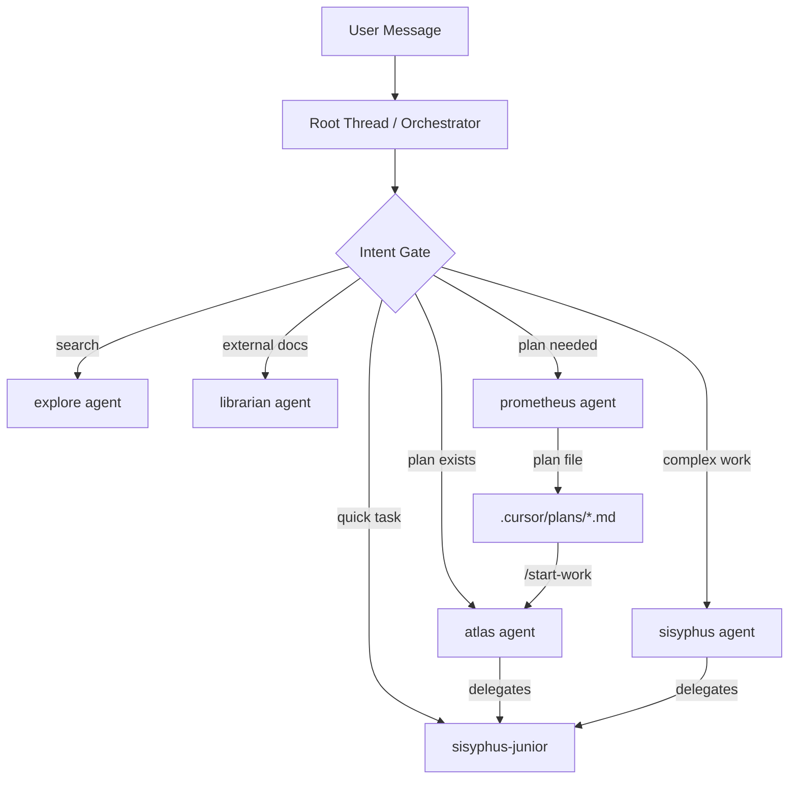
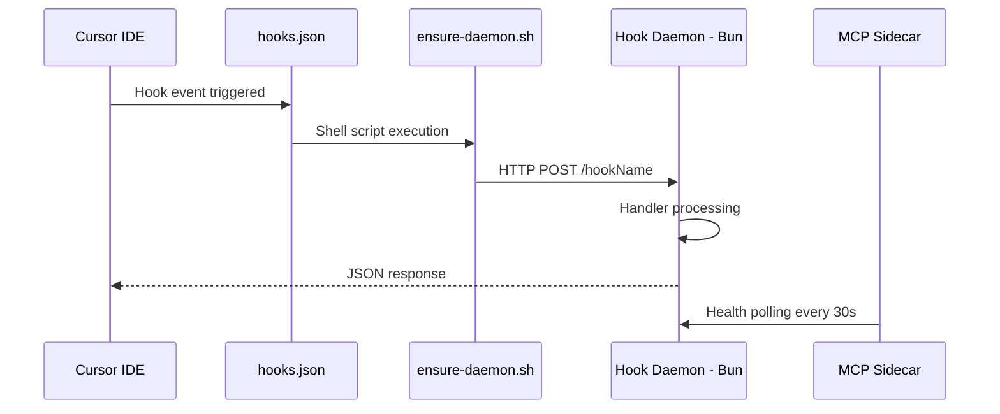
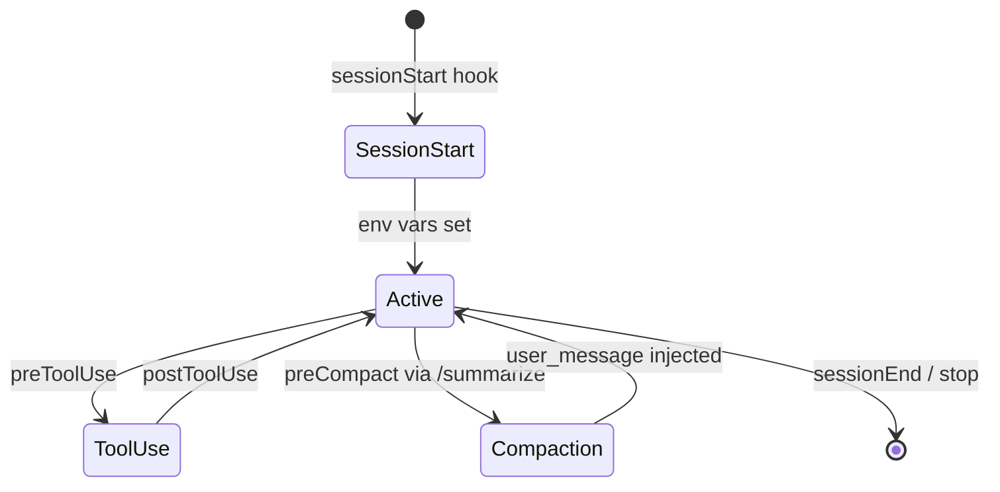
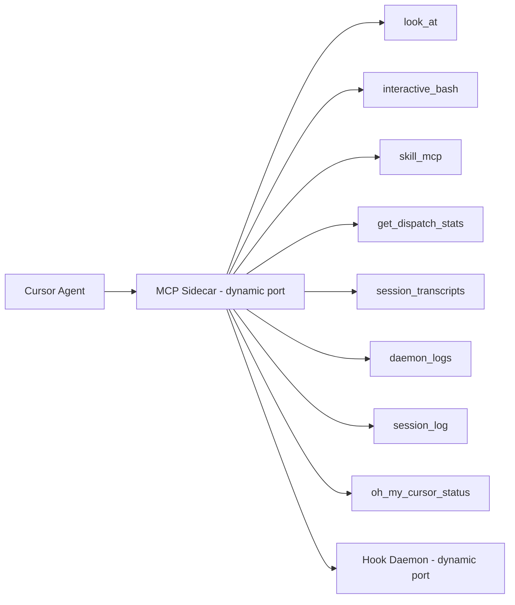

# oh-my-cursor Architecture

This document describes the system architecture of oh-my-cursor, a multi-agent orchestration plugin for Cursor IDE.

## Overview

oh-my-cursor provides 11 specialized agents, a persistent hook daemon, MCP sidecar, and continuation loops. The system intercepts Cursor's hook events via shell scripts that forward to a Bun-based HTTP daemon, which processes events and returns context injections.

## Agent Orchestration Flow

## Hook Daemon Data Flow

## Session Lifecycle

## MCP Sidecar Architecture

## Agent Architecture

### Agent Tiers

| Tier | Agents | Can Spawn Sub-agents | Can Edit Code |
|------|--------|---------------------|---------------|
| Coordinator | sisyphus, hephaestus, atlas | Yes (explore, sisyphus-junior) | Via delegation only |
| Planner | prometheus | No | Never (markdown only) |
| Reviewer | metis, momus | No | Never (read-only) |
| Worker | sisyphus-junior | No | Yes (leaf executor) |
| Specialist | explore, librarian, oracle, multimodal-looker | No | Never (read-only) |

### Background Agents

- `explore`: `is_background: true` — fast codebase search, non-blocking
- `librarian`: `is_background: true` — external doc lookup, non-blocking

## Hook System

### Hook Tiers

| Tier | Value | Hooks | Purpose |
|------|-------|-------|---------|
| SESSION | 0 | sessionStart, sessionEnd, preCompact, subagentStart, subagentStop | Session lifecycle |
| TOOL_GUARD | 1 | preToolUse, postToolUse, beforeShellExecution, beforeReadFile, etc. | Tool safety |
| TRANSFORM | 2 | afterAgentResponse, afterAgentThought | Response transformation |
| CONTINUATION | 3 | stop, beforeSubmitPrompt | Continuation loops |

### Safety Hooks

- `beforeShellExecution`: `failClosed: true` — blocks dangerous shell commands
- `beforeMCPExecution`: `failClosed: true` — blocks unauthorized MCP servers

## MCP Integration

The MCP sidecar runs alongside the daemon, providing tools to Cursor agents via the Model Context Protocol. Port coordination is managed via `/tmp/oh-my-cursor-ports.json`.

## Configuration

Two-layer config with JSONC format:
1. User config: `~/.config/oh-my-cursor/config.jsonc`
2. Project config: `.cursor/oh-my-cursor.jsonc`

Merge order: defaults → user → project. Config cached 30s.

## Session Management

Sessions are tracked in-memory with periodic persistence to `/tmp/oh-my-cursor-state.json`. Each session tracks: tool calls, dispatch counts, Ralph/Boulder loop state, compaction epochs, and error counts.

## Continuation Loops

- **Ralph Loop**: Iterative task completion via `/ralph-loop` command
- **Ultrawork Loop**: Deep work with oracle check-ins via `/ulw-loop`
- **Boulder State**: Automatic retry on tool failures with stagnation detection

See [docs/cursor-integration.md](docs/cursor-integration.md) for native Cursor feature details.
